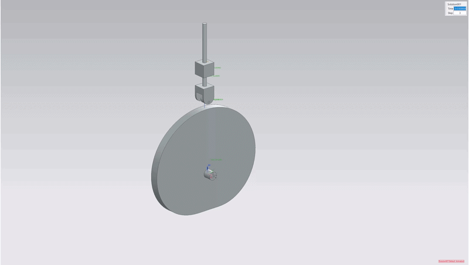
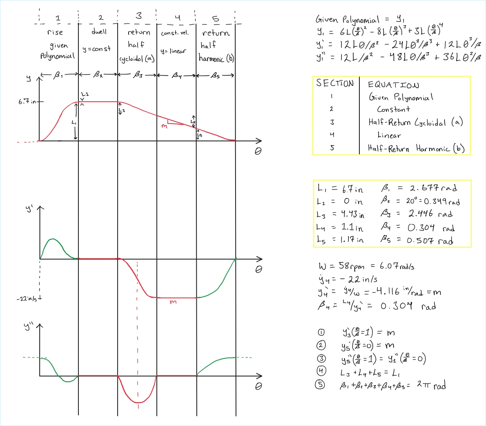

# Cam Pitch Curve Generator

Analytical cam design study in which a plate cam was synthesized to match a moving conveyor’s velocity during a simulated spot-welding operation. The piecewise motion law was implemented in Python to generate a pitch curve as a DXF spline export.



---

## Design Scenario

A conceptual assembly-line operation requires a spot weld on a part moving vertically on a conveyor belt. To avoid stopping the conveyor for each weld, the welding tip must match the belt velocity over a short distance during the welding operation. The welding tip is mounted on the follower of a plate cam driven at a constant 58 rpm. The conveyor moves at a constant velocity of −22 in/sec (downward).

Follower requirements:

- Start at bottom of lift  
- Rise 6.7 in  
- Dwell at top for 20° of cam rotation  
- During return:
  - Accelerate to −22 in/sec
  - Maintain that velocity for 1.1 in (velocity matching region)
  - Decelerate to bottom  
- Immediately repeat cycle

Because standard trigonometric motion laws force zero acceleration at the start of lift, they were unsuitable for the full-rise section. A custom polynomial motion law was selected to better satisfy the acceleration boundary conditions:

$$
y = 6L\left(\frac{\theta}{\beta}\right)^2 - 8L\left(\frac{\theta}{\beta}\right)^3 + 3L\left(\frac{\theta}{\beta}\right)^4
$$


---

## Analytical Development & Verification

Before writing the generator script, the cam motion was developed analytically as a design study. This includes non-zero interface conditions, standardized governing equations for each motion segment, and numerical verification and plotting.



---

## Implementation Summary

1. Define piecewise follower displacement function  
2. Compute velocity and acceleration analytically  
3. Evaluate pressure angle and radius of curvature  
4. Transform follower motion into pitch curve coordinates  
5. Export a closed spline as DXF for CAD integration  

---

## Key Code Snippets

Pitch curve coordinate transform:

```python
def pitch_curve(theta, E, d, y):
    lam = (2*np.pi - theta) - np.arctan(E/(d + y))
    mag = np.sqrt((d + y)**2 + E**2)
    return np.cos(lam)*mag, np.sin(lam)*mag
```

Closed spline DXF export:

```python
pts = list(zip(np.array(x_array), np.array(y_array)))
pts.append(pts[0])

msp.add_spline(fit_points=pts, dxfattribs={"flags": 1})
doc.saveas("cam_pitch_spline.dxf")
```
---

## Download Source Code

The complete analytical implementation (motion law definition, continuity handling, pitch curve generation, and DXF spline export) is available below:

**Download Python File:**  
[cam_pitch_generator.py](src/cam_pitch_generator.py)


